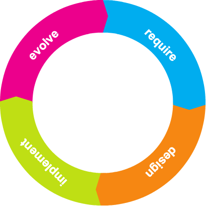

#What is Programming?

Programming is an umbrella term that we use to mean all of the activities related to creating software that runs on computer hardware. That's a very general description of what programming is, but it's tough to be much more specific and also accurate. The truth is that programming is different depending on what you're trying to do. In some cases, "programming" means writing code that is extremely difficult, uses obscure markings, and is almost incomprehensible to all but the most expert humans. In other cases, "programming" involves creating straightforward sets of instructions that use almost-human language to describe tasks that make sense even to people with no special training. Sometimes "programming" involves writing small scripts to connect discrete tools or applications in order to accomplish a set of goals. Other times "programming" means writing an entire application in a self-contained environment with well-defined boundaries.

Mostly, programming falls somewhere between these extremes. 

There are several activities that tend to be lumped together as "programming":

1. We **identify a problem** that we can solve with some form of computer software. These problems may be huge or tiny, but it's always necessary to start with some goal in mind.
2. We **identify a solution** we can "implement" in code. When talking about software, implementation is the process of building the code and other media assets required to make a solution work. 
3. We **write code**, create media assets, and populate datasets in order to make the software work. Each of these activities uses a different set of skills and requires precise planning.
4. We **make sure the software works** and fix the problems we find. Testing software requires a whole unique set of skills and approaches different from creating the software in the first place.
5. We **deploy** our software somewhere. In software terms, "deployment" means packaging and delivering code, media assets, and data for usage by an end user. (An "end user" is a person who wants to use the software we've created.)

This is, of course, a gross simplification of what it means to "program". In fact, each of these things could be broken out into much longer lists, detailing all the different efforts, techniques, knowledge, and learning that goes into every step of the process. We have the notion of a Software Development Lifecycle that contextualizes these steps into an ongoing process of development, revision, improvement, deployment, and further development.

In the diagram above, **require** refers to the process of deciding _what_ problem will be solved. The goals of the software, the **required functionalities**, are defined. The **design** phase is the process of deciding _how_ the software will be built: What technologies will be used to achieve the required functionalities, and how will everything be put together so the user can actually use the software?

Once those decisions are made, the **implement** phase is when the code is written, media assets are created, and data is populated. Eventually everything is ready and verified for deployment, which puts the software in front of the user. Once implementation is complete, the process begins to **evolve** the software in order to improve its usefulness: better features might be added, the interface may be improved, and other changes may become necessary throughout the lifespan of the software.

We see this process at play in many systems we use on a daily basis. You can probably note updates to software you use in your work or education that has changed in significant ways. The changes may have brought more features, or they may have brought more bugs, but the one thing that is consistent is that software is always changing.

The process of creating software to run on computing devices is often called **programming**, but this is a shorthand. The actual process of creating software involves many, many tasks. One of the core tasks, of course, is **writing code**. For most developers, programming refers to that specific activity of writing code.

As with every other aspect of the Software Development Lifecycle, writing code is an activity that combines many smaller activities. It is the process of writing the instructions for a computer to follow. But it is also the process of describing the relationships between parts of the software, for identifying metadata required to make use of media assets, and for describing data models required to make use of datasets.

Programming, coding, hacking&mdash;whatever you call it, the instructions we write for computers form the muscle of any software application. This is the core of what it means to create content and functionality for computing devices.

